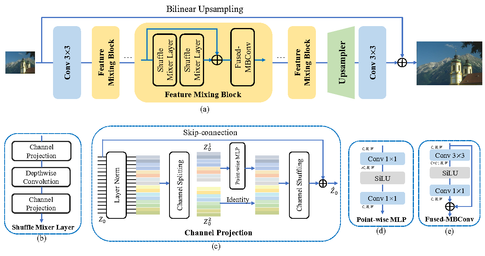

# ShuffleMixer
[](https://github.com/sunny2109/ShuffleMixer/blob/main/LICENSE)
[](https://www.python.org/)
[](https://pytorch.org/)

#### [Paper](https://openreview.net/pdf?id=ZK6lzx0jqdZ) | [Supplementary Material](https://openreview.net/attachment?id=ZK6lzx0jqdZ&name=supplementary_material) | [Discussion](https://github.com/sunny2109/ShuffleMixer/issues)
### ShuffleMixer: An Efficient ConvNet for Image Super-Resolution
By [Long Sun](https://github.com/sunny2109), [Jinshan Pan](https://jspan.github.io/), and Jinhui Tang


## Network Architecture
 

## Dependencies
- Linux (Tested on Ubuntu 18.04)
- Python 3.8.5 (Recommend to use [Anaconda](https://www.anaconda.com/download/#linux))
- [PyTorch 1.11.0](https://pytorch.org/): `pip install torch==1.11.0+cu113 torchvision==0.12.0+cu113 --extra-index-url https://download.pytorch.org/whl/cu113` 
- einops `pip install einops`
- fvcore `pip install -U fvcore`

### Installation
```
# Clone the repo
git clone https://github.com/sunny2109/ShuffleMixer.git
# Install dependent packages
cd ShuffleMixer
pip install -r requirements.txt
# Install BasicSR
python setup.py develop
```
You can also refer to this [INSTALL.md](https://github.com/XPixelGroup/BasicSR/blob/master/docs/INSTALL.md) for installation


### Training
- Run the following commands for training:
```
python basicsr/train.py -opt options/train/ShuffleMixer/train_base_DF2K_x4.yml
```

### Testing
- Download the pretrained models.
- Download the testing dataset.
- Run the following commands:
```
python basicsr/test.py -opt options/test/ShuffleMixer/test_base_benchmark_x4.yml
```
- The test results will be in './results'.


### Results
- Pretrained models and benchmark results can be downloaded from [[Google Drive]](https://drive.google.com/drive/folders/10WD7beUyoJhrahwoxsiGpZFHkReaHLhi?usp=sharing) or [[Baidu Drive]](https://pan.baidu.com/s/19fhXkd--G0mbdmgsTN7fXg)(code: idtn).

## Citation
If you find this repository helpful, you may cite:

```tex
@InProceedings{Sun_2022,
    author    = {Sun, Long and Pan, Jinshan and Tang, Jinhui},
    title     = {{ShuffleMixer}: An Efficient ConvNet for Image Super-Resolution},
    booktitle = {Advances in Neural Information Processing Systems},
    year      = {2022}
}
```

**Acknowledgment:** This code is based on the [BasicSR](https://github.com/xinntao/BasicSR) toolbox
